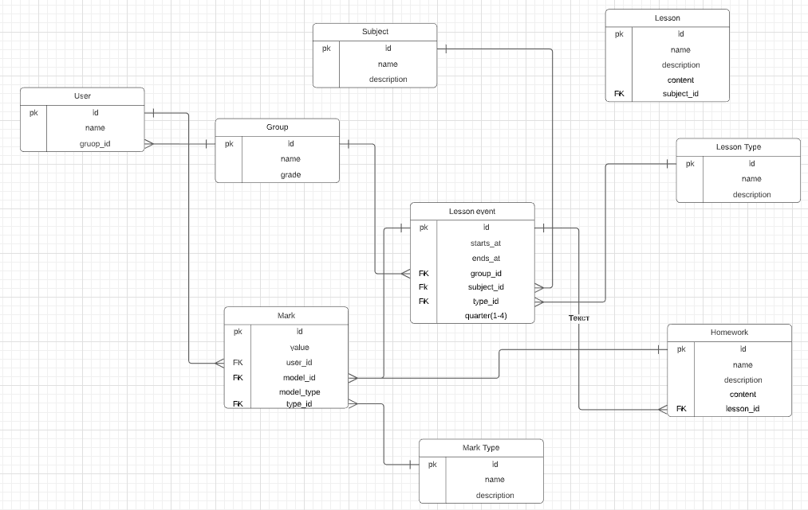

```
Requirements:
```
- php 7.4

```
Instructions:
```
- rename **Homestead.yaml.example to Homestead.yaml**
- config folders in Homestead.yaml: change path to the project
- rename .env.example and config bd
- run *composer install*
- add *192.168.10.10  e-school.test* in *hosts* file
- run **vagrant up**(if installed Vagrant, VirtualBox, Homestead) 
- run **vagrant ssh**
- go to **/code**
- run **php artisan key:generate**
- run **php artisan migrate**
- run **php artisan db:seed**

Optional
- change *QUEUE_CONNECTION* in .env to *database*
- run *php artisan config:cache*
- run *php artisan queue:work --tries=3*
```
Now api is available at e-school.test/api
Docs at e-school.test/apidoc
``` 



Дано:
- класс - список учеников
- расписание - список предметов за дату, в виде: дата, предмет, тип урока, ид урока, ид класса, четверть
- оценки - у каждого тип урока свое хранилище оценок, оценка хранится как запись с ключом - ид ученика, ид урока, результат 
у каждого типа оценок своя таблица в базе, типов оценок ограниченное количество (экзамены, обычные уроки, уроки с автоматической проверкой) 
- домашние задания (на каждый урок можно создать домашнее задание, у него так же есть оценка)


Задача: 
создать апи для получения оценок за четверть в разрезе журнала и дневника.
журнал - оценки всего класса за предмет
пример фронта журнала:
| Ученик |  01.09.2020 | 01.09.2020  | 02.09.2020   | 02.09.2020   | 03.09.2020 | 03.09.2020  | 04.09.2020   | 04.09.2020   |
|---|---|---|---|---|---|---|---|---|
| - |  урок | дз  |  урок | дз  | урок | дз  |  урок | дз   |
|  Иванов |  |  4 |   |   |5 |   |   |   |     
|  Петров |  7 | 1  |   |   |5 |   |   |   |    
|  Сидоров |  5 |   |   |   |5 |   |   |   |   

дневник - оценки по всем предметам одного ученика
пример фронта дневника:

| предмет |  01.09.2020 | 01.09.2020  | 02.09.2020   | 02.09.2020   | 03.09.2020 | 03.09.2020  | 04.09.2020   | 04.09.2020   |
|---|---|---|---|---|---|---|---|---|
| - |  урок | дз  |  урок | дз  | урок | дз  |  урок | дз   |
|  математика |  |  4 |   |   |5 |   |   |   |     
|  физра |  7 | 1  |   |   |5 |   |   |   |    
|  музыка |  5 |   |   |   |5 |   |   |   |

Нюансы: в один день может проходить 2 урока по одному предмету (сдвоенные уроки).

Цель задания: 
- показать навыки обращения с фреймворком, проектирование БД, работа с ORM, работа с апи

Требования к выполнению:
- фреймворк laravel
- php 7.x
- БД - sql (postgres, mysql)


